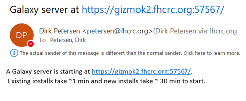
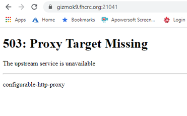
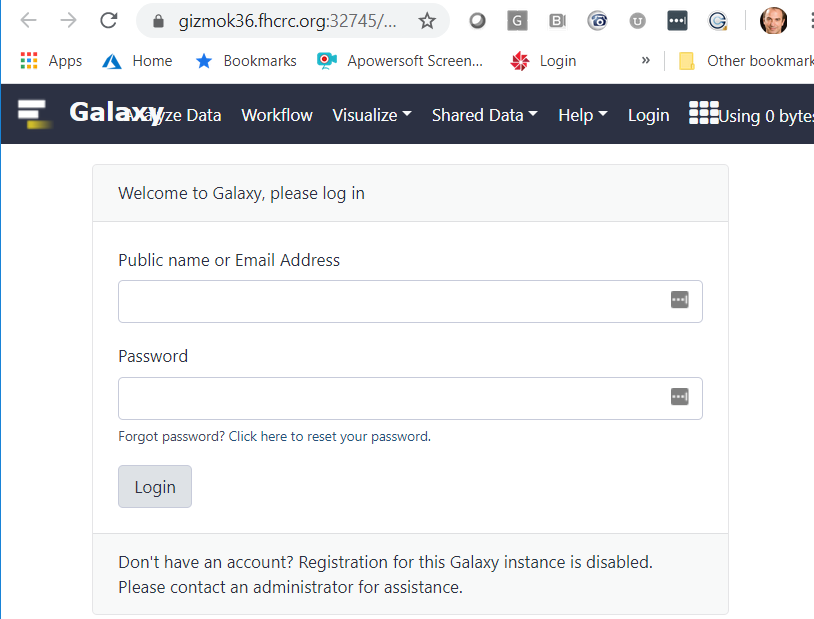
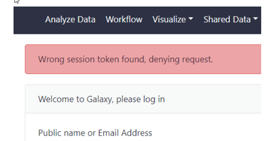

[Galaxy](https://usegalaxy.org/) is an open, web-based platform for accessible, reproducible, and transparent computational research. Users can use the public instance of Galaxy, or at the Hutch, we provide acccess to self service installations with the following features:

- HutchNet ID authentication will be used 
- The instance will run with the launching user's permissions, these will be used for all data library access (e.g. file system)
- User maintains their own workflows (and thus can migratee them to newer installation of Galaxy if/when needed)
- User can self install the software as well as restart existing Galaxy servers, or make new ones if needed
- A simple database is provided (sqlite instead of Postgres)
- Each user can have access to multiple Galaxy instances (e.g. in case software updates need to be implemented)
- Galaxy server will run on a `gizmo` node, thus compute capacity is limited to single node (36 cores)


Please check the [Galaxy Documentation](https://docs.galaxyproject.org/) for more general information about using Galaxy.  


## How to use Galaxy on Gizmo:

Starting Galaxy is simple. You just run the `galaxy` command on Rhino. Run this command in a new shell that won't be canceled/closed for a while. [We recommend tmux or NoMachine for long running shells.](/scicomputing/access_methods/). When you run the command you may just the the "New Install"

```bash
petersen@rhino03:~ galaxy
Enter number to select your Galaxy install
1) /fh/fast/_HDC/user/petersen/galaxies/demo/
2) /fh/fast/_HDC/user/petersen/galaxies/production/
3) /fh/fast/_HDC/user/petersen/galaxies/latest/
4) /fh/fast/_HDC/user/petersen/galaxies/solarsystem/
5) New-Install
#? 5
New Install: Enter a name for the Galaxy instance: brandnew
```

A few minutes after the installation has been started you receive an email like this:



Now you wait about 30 min. If you click on the link before Galaxy has finished installing you will see a proxy error: 




Try again after a while. Then you should see the Galaxy login screen. Use your HutchnetID and password to login to the Galaxy interface:




To terminate the Galaxy instance just type Ctrl+c twice inside the terminal Window. It will cancel the cluster job that runs Galaxy. 


## Current Issues

When using Chrome, you might see this error message:

"Wrong session Token found." 



To fix the issue please reset all fhcrc.org Cookies from your Chrome browser or use a new incognito window or use a different browser such as Firefox.

To remove Cookies from Chrome, go to   
-> Settings -> Privacy and Security 
-> Cookies and other site data
-> See all cookies and site data 
-> in the upper right search for fhcrc.org
and then click Remove all shown and restart Chrome

