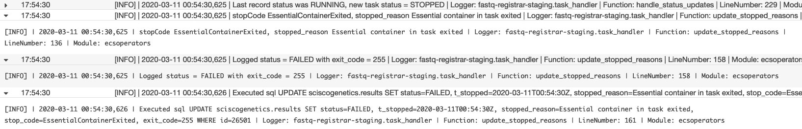

--  
title: Logging in Python
main_author: Zach Romer (zyd14)
primary_reviewers:
--
## Logging in Python

Great related reading: 
- [Python Logging Cookbook](https://docs.python.org/3/howto/logging-cookbook.html)
- [Python Logging Docs](https://docs.python.org/3.8/library/logging.html)


### What
Logging in Python is performed through the simple and elegant `logging` module which comes in the standard
Python libraries. The `logging` module enables developers to produce structured log messages and direct those 
log messages to a variety of places of output including console, files, TCP/UDP socket, syslog, and SMTP emails.

### Who
Application developers, particularly those creating services which might be hosted remotely or called by other users. 
Very helpful if using any AWS services.
 
### Why
But I can just `print` stuff I need to see... why would I bother using a logger?  
Well, if you are writing applications which
you expect others to use, might run for long periods of time, or are dependent on external services which could cause errors
in your application if they are not working properly, chances are you may not be able to watch all your `print` statements
fly across the terminal for hours on end.  Or perhaps another user encounters an error while using your service, and replicating 
the error is simply impossible because you don't know what all the inputs were, whether an external service was down, or possibly
even what the error was. In these cases you'll want to have logs detailing the use of the application leading up to the crash, hopefully
capturing what went wrong and giving you insight into how to fix the problem without necessarily having to replicate it. Python loggers 
can be set up to automatically add contextual information such as line number the log message occurred on, timestamps, function / module,
stack traces, and more, all of which can become vitally important when doing post mortems on a failure.  

A particularly helpful aspect of logging statements is the different contextual levels they have, meaning you can filter
out log messages of different types without redeploying the code.  For instance, I could use an environment variable or
configuration file where the desired log level is set.  When the program runs this could be used to set the `logging` 
module level, meaning all logging calls below that won't get reported.  As an example you might want a bunch of `.debug()`
calls around a particularly tricky piece of logic when running in one environment, but perhaps want to ignore `.debug()`
and only see`.error()` and above messages in another environment.  You could have a LOG_LEVEL environment variable which 
is then used in the code to set your logger levels to their desired state, without having to touch the code. 

In more advanced use cases one can use retrospective log analysis on structured logs to profile an application and see things 
like how often components of your application are used, identify bottlenecks, and track down areas of the code where bugs
seem to occur more often.  When running in AWS Lambda, EC2, ECS, or Batch, the `logging` module automatically routes messages 
to CloudWatch, which can be essential for troubleshooting your code when executing in the cloud. 

### How  
Now we're getting to the meat (or tempeh if you prefer) and potatoes.  

The quickest and simplest way to start logging is like this:
```python
import logging
logging.basicConfig()
logging.warning('Blargh')
```
This will setup the logging module to log messages of level WARNING and above (ERROR, EXCEPTION) to the console.  You can
provide a format string (more on `Formatter` classes and adding contextual informaation later) to your `.basicConfig()` call.
By itself this way of initialization your log facilities has fairly limited capabilities, but can be further customized 
using some of the objects and methods listed below.

Setting up a basic logger is very simple.
```python
import logging

logger = logging.getLogger('new_logger')
logger.setLevel(logging.DEBUG)

stream_handler = logging.StreamHandler()
logger.addHandler(stream_handler)

logger.info('Hello world!')
```
If you run the code above you should see `Hello world!` has been output to the terminal, much like a `print` statement would. 
Knowing this toy example doesn't really provide any obvious additional functionality to `print`, let's explore what's 
happening here.  
In the first section a `Logger` instance is created. Next, a `StreamHandler` is created, which by default will send log 
messages to `sys.stderr`.  Finally, `Hello world!` is outputted to the console by invoking the `info` method on the `Logger`
instance.   

We can quickly make this basic logger much more interesting by using a `Formatter`, which will add contextual information
to every log message which the `Handler` it is associated with emits.

```python
import logging

logger = logging.getLogger('new_logger')
logger.setLevel(logging.DEBUG)

formatter = logging.Formatter('%(asctime)s - %(name)s - %(levelname)s - %(message)s - line %(lineno)s')
stream_handler = logging.StreamHandler()
stream_handler.setFormatter(formatter)

logger.addHandler(stream_handler)
logger.info('Hello world!')
```  

Running this code, you should see something like this:  
`2020-01-23 14:46:29,928 - new_logger - INFO - Hello world! - line 11`  

Now let's examine the different components of a `Logger` to better understand what's going on.

#### Anatomy of a Logger

- ##### Logger
A `Logger` instance is created when `logging.getLogger()` is called. Without any arguments this method returns a reference 
to a global root logger instance, which is stored in the `logging` module. By providing a string representing a name to 
`getLogger()` a child logger of the root logger is created. Loggers have a concept of log propagation up a chain of related 
parent-child loggers, which can be useful in more complex situations but will not be covered here.  For more information on 
hereditary log propagation please see the [Python Logging Cookbook](https://docs.python.org/3/howto/logging-cookbook.html) 
and / or the [Python Logging Docs](https://docs.python.org/3.8/library/logging.html).    

- ##### Handlers
A handler is a critical component of a Logger instance, and provides protocols for directing log messages to a wide variety
of different possible output sources. Some of the more common handlers include a `StreamHandlers` and `FileHandlers`. It is 
common to want to see the output of your code in the terminal when you run it, but you might also want output logged to a file
somewhere in case your project is run on a cron or run by other remote users. There are a lot of different types of handlers,
including email, socket handlers, rotating file handlers, HTTP handlers, and more but I'm not going into them here.

Different log handler classes can be found listed [here](https://docs.python.org/3.8/library/logging.handlers.html#module-logging.handlers)

- ##### Formatters
`Formatter` objects determine the structure that every message will be reported in, and allow you to add contextual information
to every log message, such as line number, module name, function name, and date / time. The list of contextual information
you can add to your message by embedding the key words into your Formatter string can be found 
[here](https://docs.python.org/3.8/library/logging.html#logging.LogRecord).  Some of the attributes I find myself using
quite often are `%(lineno)d` (line number), `%(asctime)s` (timestamp), `%(filename)`, `(funcName)s`, and `%(module)s`.  
There are also some handy formatting attributes for reporting what thread or process a message is coming from if you're 
working in a concurrent environment.

By creating a Formatter object, it simply must be added to a Handler class instance using the `.setFormatter()` function,
as seen in the earlier example.  By attaching different `Formatter` objects to different handlers, you can provide different levels
of details to different outputs.  For instance, maybe I don't want the module, function, and file name cluttering up
my console, so I'd attach a formatter to it which doesn't have those attributes.  But I want my file handler to have as
much information as possible so I can better reconstruct events when doing retrospectives (example below).

```python
import logging
logger = logging.getLogger('new_logger')
logger.setLevel(logging.DEBUG)
file_formatter = logging.Formatter('%(asctime)s - %(levelname)s - %(message)s - line %(lineno)s - module %(module)s - function %(funcName)s - file %(fileName)s')
file_handler = logging.FileHandler(filename='verbose_logger.log')
file_handler.setFormatter(file_formatter)

slim_formatter = logging.Formatter('%(asctime)s - %(levelname)s - %(message)s - line %(lineno)s')
slim_console_handler = logging.StreamHandler()
slim_console_handler.setFormatter(slim_formatter)
logger.addHandler(slim_console_handler)
logger.addHandler(file_handler)
```

- ##### Filters 
`Filters` are attached to `Handlers` and provided filtering of messages from below a specified point in the logger hierarchy 
of which the `Logger` that the attached `Handler` is a part of.  We didn't go through logger hierarchies too much, but say
we have a logger hierarchy like:
```  
- base_logger  
- - module_logger  
- - debug_logger
```
where the parent-child relationships of our loggers can be described as `base_logger.module_logger` and `base_logger.debug_logger`.  
A `Filter` object can be attached to a `Logger` instance in order to prevent messages from parts of the logger hierarchy. 
`Filter` objects can also be attached to specific handlers as well, in order for more nuanced control of which loggers 
are emitted to a particular output location. 

- ##### Log levels  
Both `Logger` and `Handler` instances have an attribute called `.level`, which determines the severity of messages the 
`Logger` will emit.  Each log level is represented by a decimal number internally, although they can be referenced in a 
variety of ways.  The following table shows the various built-in log levels (although one can create their own log levels
as well).  

| Level | Int Representation | Str Representation |  
| ---- | :----: | :----: |  
| DEBUG | 10 | 'DEBUG' |  
| INFO | 20 | 'INFO' |  
| WARNING | 30 | 'WARNING' |    
| ERROR | 40 | 'ERROR' |  
| CRITICAL | 50 | 'CRITICAL' |  

These 

### Where  
I like to log early and log often, especially during the development phase of a project.  In particular, I find often 
find myself logging the responses to remote calls so I can always have a reference in my log of what the response looked
like before I start processing it.  When writing REST APIs I often will log the raw request prior to any processing, so
that when something goes wrong I can look at what data I started with and investigate from there. I've found logging to 
be invaluable for debugging stateless applications in AWS, as they pick up log messages emitted to STDOUT from your program so I 
can log state at various points in the application to better understand what might have gone wrong.  In most of my projects I
create a function to create or retrieve a pre-configured `Logger` instance early on, and use it constantly. I then use 
environment variables to set the log level of the service to reduce log message volume once the service is more stable.  

### Bonus AWS stuff
Once you're using structured logging you can start to use CloudWatch Insights to query across log groups for messages 
pertaining to any of the attributes you're logging. 

Log messages a presented in a pretty nice format on CloudWatch:  



Give me a shout at zromer@fredhutch.org if you have any questions, comments, or corrections you think should be made.