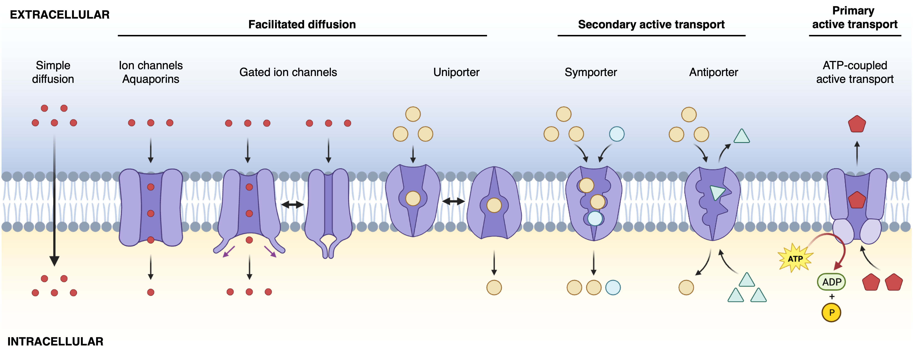
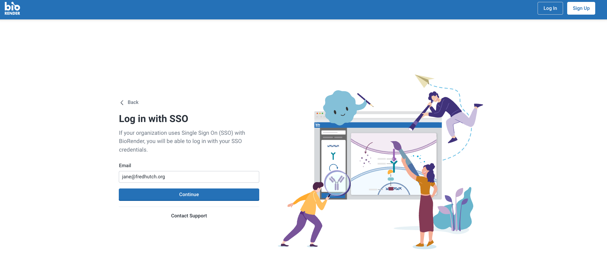

[BioRender](https://www.biorender.com/) is a web application that creates scientific figures, illustrations, and diagrams. 
An institutional license for BioRender Premium is available for Fred Hutch employees and includes unlimited illustrations, thousands of individual icons, graphical assets, templates, and permissions for journal publications.

Figure 1: Types of membrane transport mechanisms. Figure made with BioRender. Source: Matthew Chan
 

## Getting Started
To access BioRender, Fred Hutch employees may sign in using their Fred Hutch institutional email or access BioRender via the Apps menu in [Microsoft365](https://www.microsoft365.com/apps?auth=2&home=1).

Login to [BioRender using SSO](https://app.biorender.com/user/sso) and Fred Hutch credentials. 

Alternatively, users may access BioRender in [Microsoft365](https://www.microsoft365.com/apps?auth=2&home=1).

## Making Illustrations in the Web Interface

The Gallery the starting point for making and accessing files (illustrations, posters, graphs, etc). As an example, we will make a new illustration file by clicking on `+ Create new`,  then `Illustration`.

The left hand panel contains graphical assets that can used for your illustrations. There are over 5000 icons to use. Simply drag and drop an icon to the artboard to use in your illustration.

By clicking on the individual icon, the left hand panel contains several options to adjust color, style, and other graphical aspects. 

To export illustrations, click `File` > `Export`. Here, you may set export dimensions, file type, transparency, and resolution. 

## Additional Resources
- Fred Hutch hosts periodic BioRender webinars with topics ranging from introductory use, creating biological pathway diagrams, making graphical abstracts, and more. ([CenterNet Events page](https://centernet.fredhutch.org/e.html#eyJrZXl3b3JkcyI6ImJpb3JlbmRlciIsInR5cGUiOiIiLCJwYWdpbmciOjIwLCJldmVudFR5cGUiOltdLCJob3N0IjpbXSwiZGF0ZSI6e319))
-  [Tutorials provided by BioRender](https://www.biorender.com/learn)
-  [Preparing manuscript figures in BioRender](https://www.biorender.com/learn/tips-for-preparing-your-manuscript-in-biorender)