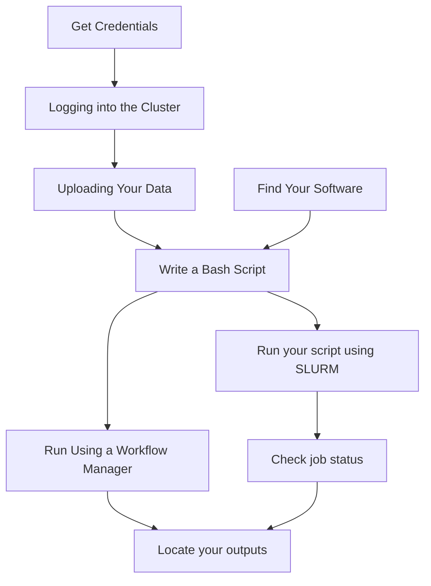

Starting out with working on the FH cluster can be a daunting process. In this article, we will point you to the right information you need to get started.

We'll use the example of aligning multiple FASTA files using BWA.

## When You're First Starting

Here is a visual index of the steps you need to get up and running on the cluster:



### Credentials

The first thing you'll need to do is request credentials for the FH cluster.

https://sciwiki.fredhutch.org/scicomputing/access_credentials/

### Logging In

The next step is to log in to the cluster through the `rhino` machines. These are powerful machines that can run code on their own, but act as controllers for the other machines in the cluster. 

https://sciwiki.fredhutch.org/scicomputing/access_credentials/#accessing-slurm-clusters

### Upload Data

The next thing to do is to move your files to either:

- `/hpc/temp` 
- `/fh/working`

[These file systems]( https://sciwiki.fredhutch.org/scicomputing/store_overview/) have the advantage of being directly connected to the cluster and are faster. They are meant to be *working storage*, so when you are done processing your files, you will need to transfer them back to either `/fh/fast/` or your own system. Note that `/hpc/temp/` and `/fh/working/`

To move files, you can use [Motuz](https://sciwiki.fredhutch.org/compdemos/motuz/), which is the web app, to move files back and forth from 
    - your computer
    - from other Fred Hutch storage (such as `/fh/fast/`) 
    - or from an AWS S3 bucket

[HutchGO is also available for transferring files](https://sciwiki.fredhutch.org/scicomputing/hutchgo_overview/), which uses an App called Globus Connect. 

You can also use an SFTP (secure FTP) client such as [Mountain Duck to transfer files as well. 

### Find the Reference Genome

- There are a number of [reference genomes](https://sciwiki.fredhutch.org/datascience/refgenomes/) that are available for use. 

- For example, for aligning files using `bwa`, we'll need the BWAIndex file that is available here: 
    - `/shared/biodata/reference/iGenomes/Homo_sapiens/UCSC/hg19/Sequence/BWAIndex` 

### Find Your Software

Most software that you need for bioinformatics work are [installed and can be utilized via software modules](https://sciwiki.fredhutch.org/scicomputing/compute_environments/#environment-modules). How do we find them? We can use `module avail bwa` to look for the proper module:

```bash
module avail bwa
```

We will get the following response:

```
------------------------------- /app/modules/all -------------------------------
   BWA/0.7.17-GCC-8.3.0     BWA/0.7.17-GCCcore-11.2.0
   BWA/0.7.17-GCC-10.2.0    BWA/0.7.17-GCCcore-12.2.0 (D)

  Where:
   D:  Default Module

Use `module spider` to find all possible modules and extensions.
Use `module keyword key1 key2 ...` to search for all possible modules matching
any of the "keys"
```

So now we can load the module up using:

```bash
module load BWA/0.7.17-GCCcore-12.2.0
```

If you can't find a software module, there is [Apptainer and other ways](https://sciwiki.fredhutch.org/datademos/computational_rank/) to get the software running in the HPC environment. 


## Batch Processing Files

At this point, we have two main paths to run the software:

1. We can use the built in job scheduler, SLURM, to batch process our files. 
2. We can automate our batching using a [WDL (Workflow Description Language)](https://hutchdatascience.org/Developing_WDL_Workflows/) file and [PROOF](https://sciwiki.fredhutch.org/datademos/proof-how-to/)

### Using SLURM

You can use SLURM directly to run compute jobs, which is the low level task manager for the cluster. There is a [guide to SLURM for parallel jobs here](/pathways/path-batch-computing/).

    - Pros: This is the fastest way to get a single set of tasks running.
    - Cons: It is difficult to execute SLURM jobs that have multiple steps in a pipeline

### Batch Jobs with Workflow Managers

[Workflow managers such as Cromwell and Nextflow](/scicomputing/compute_parallel/#workflow-managers) are made to handle multi-step workflows. For example, you may want to process files with BWA and then apply Mutect to each file.

    - Pros: reproducible and can be extended to multiple steps with the WDL file. Handles intermediate outputs, and is highly configurable.
    - Cons: a little more of a learning curve to write your own WDL files

