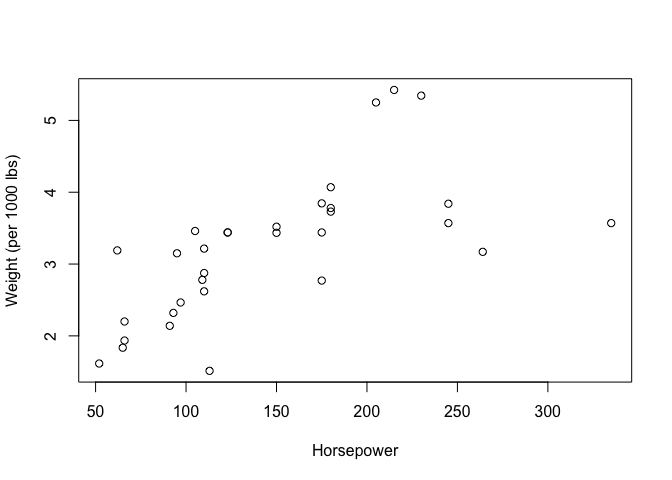
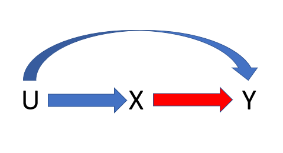
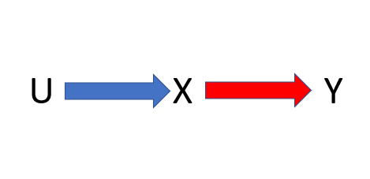
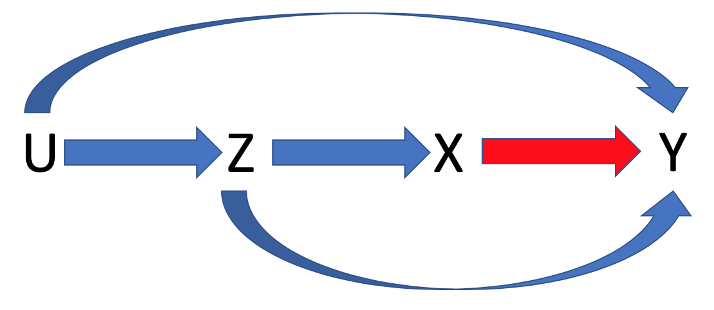

On this page we give a brief overview of confounding and confounders. We note that confounding can sometimes verge into a philosophical discussion and there is no test for whether a variable is a confounder. We are only providing a brief overview along with an example and some simulations. In addition, confounding also often involves a discussion on causality. Therefore, when thinking about what variables to adjust for in the study it is important to assess prior to the analysis what pathways or variables may influence your results. 

First, let us give a formal definition of confounding.

>> Confounding exists if meaningful different interpretations of the relationship of interest result when an extraneous variable is ignored or included in the analysis

>> -*Applied Regression Analysis and other Multivariable Methods*, Kleinbaum, Kupper, Nizam, Muller. 4th edition.

This is just one definition of confounding and more technical/philosophical definitions [exist](https://projecteuclid.org/euclid.aos/1364302740). In more concise words, confounding exists when the relationship between an exposure and outcome is impacted by a third variable that is associated with both exposure and outcome. Consider the following examples: 
1. There is a strong association between ice cream consumption and drowning. Does eating ice cream increase the risk of drowning?
2. There is a strong association between how many fire fighters are at a fire and how much fire damage occurs. Do firefighters lead to more fire damage?

In both examples, the correct answer is no. In the first, the relationship is confounded by the time of year. In the second example, the association is confounded by the size of the fire. 

## Example between weight of a car and horsepower. 


We will first consider an example using the mtcars package within R.
``` r
    head(mtcars)
```
    ##                    mpg cyl disp  hp drat    wt  qsec vs am gear carb
    ## Mazda RX4         21.0   6  160 110 3.90 2.620 16.46  0  1    4    4
    ## Mazda RX4 Wag     21.0   6  160 110 3.90 2.875 17.02  0  1    4    4
    ## Datsun 710        22.8   4  108  93 3.85 2.320 18.61  1  1    4    1
    ## Hornet 4 Drive    21.4   6  258 110 3.08 3.215 19.44  1  0    3    1
    ## Hornet Sportabout 18.7   8  360 175 3.15 3.440 17.02  0  0    3    2
    ## Valiant           18.1   6  225 105 2.76 3.460 20.22  1  0    3    1

We are interested in the association between the horsepower of the car and the weight of the car
within this dataset (the "hp" and "wt" columns). Looking at the relationship between these
two variables




And is there a significant association between these two variables?
``` r
    summary(lm(wt~hp,data=mtcars))
``` 
    ## 
    ## Call:
    ## lm(formula = wt ~ hp, data = mtcars)
    ## 
    ## Residuals:
    ##      Min       1Q   Median       3Q      Max 
    ## -1.41757 -0.53122 -0.02038  0.42536  1.56455 
    ## 
    ## Coefficients:
    ##             Estimate Std. Error t value Pr(>|t|)    
    ## (Intercept) 1.838247   0.316520   5.808 2.39e-06 ***
    ## hp          0.009401   0.001960   4.796 4.15e-05 ***
    ## ---
    ## Signif. codes:  0 '***' 0.001 '**' 0.01 '*' 0.05 '.' 0.1 ' ' 1
    ## 
    ## Residual standard error: 0.7483 on 30 degrees of freedom
    ## Multiple R-squared:  0.4339, Adjusted R-squared:  0.4151 
    ## F-statistic:    23 on 1 and 30 DF,  p-value: 4.146e-05

It appears that the horsepower of the car is highly associated with the
weight of the car (looking at the p-value above). Now let us say we adjusted for the number of
cylinders the car has. Let's plot horsepower vs weight color coding by
the number of cylinders.
``` r
    thecols<-rep("black",nrow(mtcars))
    thecols[which(mtcars$cyl==8)]<-"red"
    thecols[which(mtcars$cyl==6)]<-"blue"
    plot(mtcars$hp,mtcars$wt,xlab="Horsepower",ylab="Weight",col=thecols)
``` 


And if we now adjust for number of cylinders within our analysis:
``` r
    summary(lm(wt~hp+cyl,data=mtcars))
``` 
    ## 
    ## Call:
    ## lm(formula = wt ~ hp + cyl, data = mtcars)
    ## 
    ## Residuals:
    ##     Min      1Q  Median      3Q     Max 
    ## -0.8446 -0.4442 -0.1562  0.3092  1.4262 
    ## 
    ## Coefficients:
    ##              Estimate Std. Error t value Pr(>|t|)   
    ## (Intercept) 0.5820880  0.4348124   1.339  0.19107   
    ## hp          0.0003422  0.0029772   0.115  0.90930   
    ## cyl         0.4177733  0.1142980   3.655  0.00101 **
    ## ---
    ## Signif. codes:  0 '***' 0.001 '**' 0.01 '*' 0.05 '.' 0.1 ' ' 1
    ## 
    ## Residual standard error: 0.6298 on 29 degrees of freedom
    ## Multiple R-squared:  0.6125, Adjusted R-squared:  0.5858 
    ## F-statistic: 22.92 on 2 and 29 DF,  p-value: 1.072e-06

We see that horsepower is no longer associated with the weight of the
car. Now again, this is a contrived example, but why is this happening?
The number of cylinders is a confounder of weight and
horsepower. The more cylinders a car has, the higher the
horsepower. In addition, the more cylinders a car has: the larger the weight of the car. Now a mechanic or an engineer
would tell us that this is a no brainer, but if we are not knowledgeable
in the field, we may miss this and come to an incorrect conclusion. 

**That's why when planning a study,
it is always important to discuss what the important
covariates are and what needs to be adjusted for so as to avoid confounding.** 

## Additional Terms

Let's go over a few additional terms that relate to confounding. 


### Simpson's Paradox
Simpson's paradox occurs when the association between two variables differs when adjusting by the stratum of a third variable. Consider a scenario where we are interested in the association between X and Y. We have a third variable U that has two levels. Simpson's paradox occurs when the association between X and Y within each of the levels of U is opposite than the distribution between X and Y if we did not adjust for U. [Wikipedia](https://en.wikipedia.org/wiki/Simpson%27s_paradox) has a nice write up of this phenomenon.

### Collider Bias

Collider bias often occurs when researchers over adjust within their study. One way it can occur when both the exposure and the outcome affect a third variable through independent pathways. Adjusting for this third variable can then bias the results. More info can be found [here](https://catalogofbias.org/biases/collider-bias/). Collider bias is different than confounding but should still be considered in your analysis.

### The Ten Percent Rule of thumb
As there is no test for whether or not there is confounding or if a variable is a confounder, a common rule of thumb is the so-called "10% rule". The 10% rule states that if adjusting for a third variable changes the effect estimate by over 10% than there is evidence that the variable is a confounder. In our horsepower example above, adjusting for the number of cylinders changes the estimated effect of horsepower on weight from 0.009401 to 0.0003422 or a change of approximately 96% ((0.009401-0.0003422)/0.009401). By the 10% rule, the number cylinders would be considered a confounder. It's important to note that this is just a rule of thumb, it is only meant to guide researchers. In addition, it is scale specific. Let us say that we had run a logistic regression for some disease status (outcome) and smoking status (exposure) and we adjust for alcohol use. We are interested if alcohol use is a confounder. Do we look at the change in magnitude on the log odds scale or the odds ratio scale?  Caution should be warranted. 


## Simulations

Hopefully now you have a better understanding of confounding. Here we will just perform some simulation scenarios for those that are still curious. 

Let us assume that we are interested in the association between a variable X and an outcome Y. We have the following Directed Acyclic Graph  (a DAG) that describes the relationship between X and Y. There is in addition some variable U, that may influence the analysis.

### Simulation scenario 1


To read this DAG, it says U occurs before X before Y. X has an effect on Y, U affects X and affects Y (via the arrows).

If we were running an analysis to understand the association between X and Y (the red arrow in the above DAG) we would need to adjust for U in our analysis. Why? Because if we did not, we could not be sure that the association that we are observing between X and Y is not being driven due to the backdoor path from X to Y that goes through U. If we condition on U, we block this backdoor path from X to Y going through U. 

Let us evaluate via simulation, we have that the effect of X onto Y conditional on U is 1, the effect of
U onto X is 2, and the effect of U onto Y conditional on X is 2. We will
perform 1000 replications of this assuming we were studying this in 1000
independent observations.
``` r
    N<-1000 # sample size
    niter<-1000 #number iterations

    betaY<-1 # effect of X onto Y conditional on U
    alphaX<-2 # effect of U onto X 
    alphaY<-2 # effect of U onto Y conditional on X
    set.seed(08121919)
    TheEst<-matrix(nrow=niter,ncol=2)
    for(i in 1:niter){
      U<-rnorm(N) # Generate U      
      X<-alphaX*U+rnorm(N) #Generate X      
      Y<-alphaY*U+betaY*X+rnorm(N) # Generate Y    
      E1<-coef(lm(Y~X))[2] #Estimate the effect of X onto Y ignoring U   
      E2<-coef(lm(Y~X+U))[2]  # Estimate the effect of X onto Y if we accounted for U.    
      TheEst[i,]<-c(E1,E2)
    }
``` 
And let us look at the results:
``` r
    mean(TheEst[,1])
``` 
    ## [1] 1.800665

We have a biased effect of X onto Y. It is not close to the true effect conditional on U of 1. Now look at the mean if we adjusted for U. 
``` r
    mean(TheEst[,2])
``` 
    ## [1] 1.001666

Which is the expected result. It's much closer to 1.


### Simulation Scenario 2
Now consider the following scenario.



We would not have to adjust for U because there is no path from X to Y that goes through U. But again, this is not something you can necessarily test for. In this setting, U is not a confounder.

``` r
    betaY<-1 # effect of X on Y
    alphaX<-2 # effect of U on X
    alphaY<-0 # effect of U on Y
    set.seed(03151920)
    TheEst2<-matrix(nrow=niter,ncol=2)
    for(i in 1:niter){
      U<-rnorm(N)
      
      X<-alphaX*U+rnorm(N)
      
      Y<-alphaY*U+betaY*X+rnorm(N)
      
      E1<-coef(lm(Y~X))[2]
      E2<-coef(lm(Y~X+U))[2]
      TheEst2[i,]<-c(E1,E2)
    }
``` 
And let us look at the results:
``` r
    mean(TheEst2[,1])
``` 
    ## [1] 1.00121

We see that it is close to 1 as expected. It is no longer bias as U does
not have an effect on Y. If we look at the results if we had adjusted for U, we see that it is pretty much the same.
``` r
    mean(TheEst2[,2])
``` 
    ## [1] 1.001913

Which is again unbiased.

### Simulation Scenario 3
Let us increase the complexity and add an additional variable Z. 



We observe Z and U. If we do not adjust for Z, we will get a bias estimate of the effect of X onto Y. This is due to there being a backdoor path from X to Y that goes through Z. However, if we do adjust for Z we would be able to get an unbiased estimate of the effect of X onto Y.

Consider a simulation scenario with Z. The effect of X onto Y
conditional on U and Z is 1, the effect of U onto X conditional on Z is
0, the effect of Z onto X conditional on U is 3, the effect of Z onto Y
conditional on U and X is 1, and the effect of U onto Y conditional on X
and Z is 2. Finally, the effect of U onto Z is 2.


``` r
    set.seed(01291947)
    betaY<-1
    alphaX<-0
    alphaY<-2
    alphaZ<-2
    tauX<-3
    tauY<-1
    TheEst3<-matrix(nrow=niter,ncol=2)
    for(i in 1:niter){
      U<-rnorm(N)
      Z<-alphaZ*U+rnorm(N)
      X<-alphaX*U+tauX*Z+rnorm(N)      
      Y<-alphaY*U+betaY*X+tauY*Z+rnorm(N)      
      E1<-coef(lm(Y~X))[2] #If we do not adjust for Z
      E2<-coef(lm(Y~X+Z))[2]       #If we do adjust for Z
      TheEst3[i,]<-c(E1,E2)
    }
    mean(TheEst3[,1])

    ## [1] 1.587053
``` 
We have a bias estimate of Z as we did not adjust for Z. If, however we adjust for Z:
``` r
    mean(TheEst3[,2])
``` 
    ## [1] 1.000552


### Simulation Scenario 4

Consider the same scenario, but now U has an effect on X that is not through Z. 
``` r
    set.seed(10301939)
    betaY<-1
    alphaX<-2
    alphaY<-2
    alphaZ<-2
    tauX<-3
    tauY<-1
    TheEst4<-matrix(nrow=niter,ncol=2)
    for(i in 1:niter){
      U<-rnorm(N)
      Z<-alphaZ*U+rnorm(N)
      X<-alphaX*U+tauX*Z+rnorm(N)      
      Y<-alphaY*U+betaY*X+tauY*Z+rnorm(N)      
      E1<-coef(lm(Y~X))[2]
      E2<-coef(lm(Y~X+Z))[2]
      TheEst4[i,]<-c(E1,E2)
    }
    mean(TheEst4[,1])
``` 
    ## [1] 1.473036

We see that this estimate of the effect of X onto Y is biased, as it was
before. But now, what if we adjust for Z?
``` r
    mean(TheEst4[,2])
``` 
    ## [1] 1.443087

We see that it is bias as U has an effect on X that is not through Z. To get an unbiased result we would have to adjust for U as well. 

### Simulation Scenario 5

We encourage you to play around with the simulation parameters. What would
happen if you set betaY (the effect of X onto Y)=0? Would we maybe incorrectly assume
that X has an effect on Y if we did not adjust for U or Z?


### Simulation Scenario 6
Now let us look at a simulation examining collider bias. As mentioned earlier, this is fundamentally different than confounding. Suppose we have yet another variable "A" that is caused by U and Z via two independent pathways. In addition, U and Z are now independent and Z no longer has an effect on X. Finally, U only affects Y through X. In DAG form:


``` r
    set.seed(10161946)
    betaY<-1
    alphaX<-2
    alphaY<-0
    alphaZ<-2
    alphaA<-2
    tauX<-0
    tauY<-1
    tauA<-1.5
    TheEst6<-matrix(nrow=niter,ncol=3)
    for(i in 1:niter){
      U<-rnorm(N)
      Z<-rnorm(N)
      A<-alphaA*U+tauA*Z+rnorm(N)
      
      X<-alphaX*U+tauX*Z+rnorm(N)
      
      Y<-alphaY*U+betaY*X+tauY*Z+rnorm(N)
      
      E1<-coef(lm(Y~X))[2]
      E2<-coef(lm(Y~X+Z))[2]
      E3<-coef(lm(Y~X+A))[2]
      TheEst6[i,]<-c(E1,E2,E3)
    }
```

Now let us look at the results

``` r
    mean(TheEst6[,1])
```
    ## [1] 1.000552
 
This is unbiased. What if we adjusted for Z?

``` r
    mean(TheEst6[,2])
``` 
    ## [1] 1.000665


And if we adjust for A?

``` r
    mean(TheEst6[,3])

    ## [1] 0.7048837
```
We now have a biased estimate of the effect of X on Y. By adjusting for A, we have induced collider bias. For a nice write up of this phenomenon, check out the [Catalogue of Bias](https://catalogofbias.org/biases/collider-bias/).


