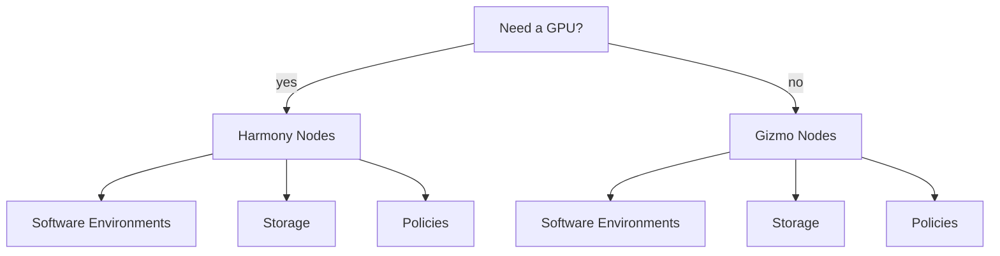

## Which Cluster Architecture Should I Use?

> IMPORTANT: THIS IS JUST A DRAFT! This is just to mock up what documentation will look like with multiple cluster environments.  No numbers or paths are to be trusted in this version of the doc.

There are two main clusters in the Fred Hutch System. They differ in the node types that are available, but also in:

- Which storage systems they can access
- What software environments/modules are available
- What Policies they are under (i.e., length of permitted jobs, number of nodes available, etc.)

The following diagram shows the main differences between the two cluster types:

- Gizmo Cluster
	- Contains General Purpose Compute Nodes
	- Older, less capable GPU compute nodes
- Chorus Cluster
	- More capable GPU nodes

More detailed documentation on these systems can be found:

 - [gizmo](/scicomputing/gizmo/gizmo_index/)
 - [chorus](/scicomputing/chorus/chorus_index/)

## Comparing Systems

### Available Hardware

| The thing | Gizmo | Chorus |
| ---       | ----  | ----   |
| processors     | Intel Gold   | AMD     |
| GPUs     | NVIDIA 1080,2080   | NVIDIA L40S     |
| Peak Available Memory   | 700 GB  | 1500 GB |

### Storage

| The thing | Gizmo | Chorus |
| ---       | ----  | ----   |
| fast     | /fh/fast   | /fh/fast     |
| home     | /homes   | no^     |
| temp     | /hpc/temp   | /hpc/temp     |

^ home directories are local to the Chorus cluster, and not the shared homes on gizmo

### Limits

| The thing | Gizmo | Chorus |
| ---       | ----  | ----   |
| Max Walltime     | 30 days   | 7 days     |
| Default Walltime     | 3 days   | 12 hours     |
| Memory per CPU | 20 GB  | 40 GB |
| Max GPU per Account | 20  | 4 |
| Default Partition | campus-new  | main |
| Short Partition | short | short |
| Restart Partition | restart-new | - |

### Software Environments Available

| The thing | Gizmo | Chorus |
| ---       | ----  | ----   |
| thing     | yes   | no     |

##### Table Template

| The thing | Gizmo | Chorus |
| ---       | ----  | ----   |
| thing     | yes   | no     |

