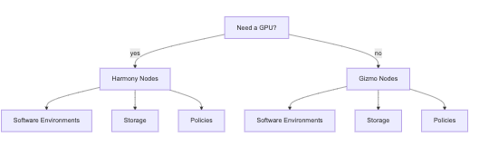

## Which Cluster Architecture Should I Use?

There are two main clusters in the Fred Hutch System. They differ in the node types that are available, but also in:

- Which storage systems they can access
- What software environments/modules are available
- What Policies they are under (i.e., length of permitted jobs, number of nodes available, etc.)

The following diagram shows the main differences between the two cluster types:

- Gizmo 
	- Contains General Purpose Compute Nodes
	- Use if you don't need to run GPU enabled software
- Harmony 
	- Contains GPU enabled nodes
	- Use if you need to run GPU-enabled software (PyTorch, etc.)

## Gizmo Nodes

### Software Environments Available

### Storage

### Policies

## Harmony Nodes

### Software Environments Available

### Storage

### Policies

